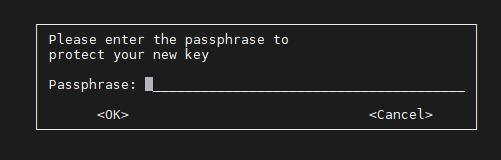

# VAULT met GPG

## Waarom
Ansible vault biedt de mogelijkheid om secrets te versleutelen.
Denk bijvoorbeeld aan wachtwoorden en certificaten.
Deze secrets kunnen dan versleuteld worden opgeslagen in de inventory in een (publieke) git repository.
En voor het uitvoeren van ansible is dan het wachtwoord van de vault nodig om de secrets te kunnen gebruiken.
Dit wachtwoord wordt opgeslagen in Secret Server, maar mag dan alleen beschikbaar zijn aan de gebruiker zelf.
Opslaan in een bestand in cleartext is niet veilig en gebruik maken van dingen als base64 maakt het niet veel veiliger.

Daarom maken we hierbij gebruik van GPG en pass.
Pass is een lokale wachtwoorden database die gebruik maakt van GPG.
En GPG biedt de mogelijkheid om de data te versleutelen.
En gpg-agent beidt de optie om de database in de lokale sessie open te houden zonder dat iedere keer het wachtwoord opnieuw ingevuld moet worden.

## Hoe werkt het
In totaal werkt het dus als volgt:
- gebruiker draait Ansible
- Ansible draait een script die gebruik maakt van pass om het wachtwoord op te halen
- pass gebruikt gegevens uit gpg, gpg start gpg-agent, gpg-agent vraagt om een wachtwoord
- Gebruiker vul het juiste wachtwoord in (dit wachtwoord is een persoonlijk wachtwoord)
- Pass kan het wachtwoord van de vault decrypten en geeft het terug aan het bash script die het aan Ansible terug geeft
- Gebruiker draait ansible nog een keer, gpg-agent is al geactiveerd, gebruiker wordt niet gevraagd om het (persoonlijke) wachtwoord.
- Een andere gebruiker werkt met zijn egen gpg en eigen persoonlijk wachtwoord
- Een andere gebruiker die middels sudo deze gerbuiker wordt weet het gpg persoonlijke wachtwoord niet

## Hoe zet je het op
In deze repository bevinden zich 2 scripts voor het opzetten en gebruiken van gpg voor de vault passwords:
- [./bin/init_gpgvault](bin/init_gpgvault)
- [./bin/gpgvault](bin/gpgvault)

Allereerst draai je ./bin/init_gpgvault en vult (met de hand) een aantal zaken in:
- kies (1) RSA and RSA (default)
- kies een keysize van 4096
- kies 0 = key does not expire
- kies y (This is correct)
- Vul je naam in
- Vul je Email adres van rivm in
- Vul RIVM in als commen (of wat je zelf ook wilt, niet belangrijk)
- Kies O (Okay)
- gpg opent een password box
  - 
  - Vul een wachtwoord in voor de GPG store (jouw persoonlijke wachtwoord) en druk op OK
  - Vul nogmaals het wachtwoord in voor de GPG store (jouw persoonlijke wachtwoord)
- Op de shell vraagt pass om het Vault wachtwoord welke je wilt opslaan
  - Vul het wachtwoord van Ansible Vault in.
  - Vul nogmaals het wachtwoord van Ansible Vault in.

Zie Appendix voor een voorbeeld output...

## Hoe gebruik je het
Bij het draaien van Ansible geef je het gpg script op.
Voorbeeld 1:
```
ansible-playbook --vault-password-file "$PWD/bin/gpgvault" -i environments/poc/ ./functional-all.yml

```
Voorbeeld 2:
```
export ANSIBLE_VAULT_PASSWORD_FILE=$PWD/bin/gpgvault
ansible-playbook -i environments/poc/ ./functional-all.yml
```

# Appendix: Voorbeeld output
Als voorbeeld, dit ziet er zo ongeveer zo uit:
```
[mannems@sscc-dbabh-l01p pgvillage]$ ./bin/init_gpgvault
gpg (GnuPG) 2.2.20; Copyright (C) 2020 Free Software Foundation, Inc.
This is free software: you are free to change and redistribute it.
There is NO WARRANTY, to the extent permitted by law.

gpg: directory '/home/mannems/.gnupg' created
gpg: keybox '/home/mannems/.gnupg/pubring.kbx' created
Please select what kind of key you want:
   (1) RSA and RSA (default)
   (2) DSA and Elgamal
   (3) DSA (sign only)
   (4) RSA (sign only)
  (14) Existing key from card
Your selection? 1
RSA keys may be between 1024 and 4096 bits long.
What keysize do you want? (2048) 4096
Requested keysize is 4096 bits
Please specify how long the key should be valid.
         0 = key does not expire
      <n>  = key expires in n days
      <n>w = key expires in n weeks
      <n>m = key expires in n months
      <n>y = key expires in n years
Key is valid for? (0) 0
Key does not expire at all
Is this correct? (y/N) y

GnuPG needs to construct a user ID to identify your key.

Real name: Sebastiaan Mannem
Email address: sebastiaan.mannem@rivm.nl
Comment: RIVM
You selected this USER-ID:
    "Sebastiaan Mannem (RIVM) <sebastiaan.mannem@rivm.nl>"

Change (N)ame, (C)omment, (E)mail or (O)kay/(Q)uit? O
We need to generate a lot of random bytes. It is a good idea to perform
some other action (type on the keyboard, move the mouse, utilize the
disks) during the prime generation; this gives the random number
generator a better chance to gain enough entropy.
We need to generate a lot of random bytes. It is a good idea to perform
some other action (type on the keyboard, move the mouse, utilize the
disks) during the prime generation; this gives the random number
generator a better chance to gain enough entropy.
gpg: /home/mannems/.gnupg/trustdb.gpg: trustdb created
gpg: key C69B75BA851264A6 marked as ultimately trusted
gpg: directory '/home/mannems/.gnupg/openpgp-revocs.d' created
gpg: revocation certificate stored as '/home/mannems/.gnupg/openpgp-revocs.d/78E5AC0AAEA6DC2477899108C69B75BA851264A6.rev'
public and secret key created and signed.

pub   rsa4096 2022-02-08 [SC]
      78E5AC0AAEA6DC2477899108C69B75BA851264A6
uid                      Sebastiaan Mannem (RIVM) <sebastiaan.mannem@rivm.nl>
sub   rsa4096 2022-02-08 [E]

gpg: checking the trustdb
gpg: marginals needed: 3  completes needed: 1  trust model: pgp
gpg: depth: 0  valid:   1  signed:   0  trust: 0-, 0q, 0n, 0m, 0f, 1u
mkdir: created directory '/home/mannems/.password-store/'
Password store initialized for 78E5AC0AAEA6DC2477899108C69B75BA851264A6
mkdir: created directory '/home/mannems/.password-store/pgvillage'
mkdir: created directory '/home/mannems/.password-store/pgvillage/pgvillage'
Enter password for github.coml/pgvillage/pgvillage.git:
Retype password for github.coml/pgvillage/pgvillage.git:
[mannems@sscc-dbabh-l01p pgvillage]$
```

