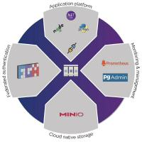

# Branding

This page has the logo's we use with PgVillage.

## Logo

### PNG formatted source

<figure markdown="span">
  { loading=lazy }
  <figcaption>PNG logo</figcaption>
</figure>

<figure markdown="span">
  { loading=lazy }
  <figcaption>PNG logo high res</figcaption>
</figure>

### JPG formatted size variants

<figure markdown="span">
  { loading=lazy }
  <figcaption>JPEG logo</figcaption>
</figure>
