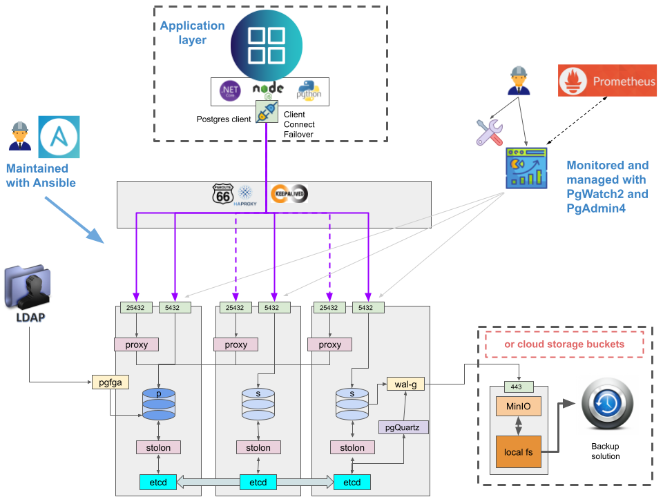

# Overview

## What PgVillage is **NOT**

Imagine a large (capital?) city. So much traffic, so much noise, so much going on,too much to follow.
There is zero trustworthyness, but
Everybody has access, nobody has oversight or control, and everybody seems annonymous, untrustworthy, and to be there for their own benefit.
The streets are filthy, the river enters the city heavilly poluted, and leaves the city even more poluted.

!!! note
    We love cities, just trying to paint a picture ;)

Now imagine your database solutions to be resembled by this city, the data being resembled by the data. And you know what PgVillage is not. PgVillage is the very opposite.

## What PgVillage **IS**

With PgVillage, everything is calm, the data that enters should be clean, or at least it stands out as being dirty because of the input, not because of the infrastructure itself.
There has been put a lot of effort into authorization:

- Peer (your neighbour) if you can
- cert (thrusted by a thrustworthy 3rd party, with all papers in place) for everything your neighbor cannot help
- LDAP, Kerberos, oAuth for maintenance guys, bt only those that should have access. And they are still someone your probably know on a personal level

PgVillage offers a robust architecture, with state of the art infrastructure, such as

- [Stolon](../administrators-guide/tools/stolon.md) relying on [etcd](../administrators-guide/tools/etcd.md) for High Availability
- [WAL-g](../administrators-guide/tools/wal-g.md) and [minio](../administrators-guide/tools/minio.md) for backup
- Prometheus / Grafana for metrics, alerts and dashboards
- Properly connect to PostgreSQL
  - with Client Connection Failover if you can, or
  - with [stolon-proxy](../administrators-guide/tools/stolon.md) which always points at the current pimary, or
  - use a proxy with [pgroute66](../administrators-guide/tools/pgroute66.md), [haproxy](../administrators-guide/tools/haproxy.md) and optionally [keepalived](../administrators-guide/tools/keepalived.md) for VIP management if you want.
- [PgQuartz](../administrators-guide/tools/pgquartz.md) for PostgreSQL miantenance
- Implement federated authorization (ldap sync), and manage the resources such as databases, extensions, users, roles, etc. with [pgfga](../administrators-guide/tools/pgfga.md)
- With PgVillage you are in control of how you leverage the power of PostgreSQL.
  Run your favorite distribution, deploay and maintain with ease, use the Power of PostgreSQL with Foreign Data Wrappers such as db2_fdw

With PgVillage you keep your data in a safe, trustworthy place. No Vendor Lockin, no corporate suits chasing you for money, just support when you need it and for what you need it.
With PgVillage you are relaxed, healthy, in control, and happy.

## Design

